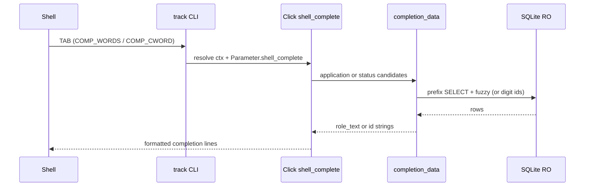

# feat: Tab completion for track update (Click shell_complete)

> **Deferred in v2 MVP.** Subcommand completion ships via `install.sh`; `track update` ID/status completion is not implemented. Revisit when `edit` / `delete` land or completion is explicitly requested.

## Summary

Ship optional shell tab completion for `track update` using Click `shell_complete`, reusing the existing read-only `completion_data.py` layer and fuzzy runtime resolution in `applications.py`. Most data-layer work is already landed; remaining work wires completers on the `update` command, adds Click integration tests, removes argcomplete packaging remnants, and documents `track --install-completion`.

---

## Problem Frame

Users update application status from the terminal with long `role_text` values or numeric IDs. The product reference requires fuzzy identifier resolution (WRatio ≥ `FUZZY_MATCH_THRESHOLD`, default 85) and optional tab completion with native shell UX (single match fills; multiple matches list on double-Tab). v2 migrated to Click; completion was deferred during that migration. This plan finishes completion on Click’s built-in path without argcomplete or a custom completion subcommand.

---

## Requirements

- R1. Tab on `track update`’s first positional proposes application identifier candidates from the local DB when the user has typed a non-empty partial value.
- R2. Tab on `track update`’s second positional proposes status tokens from `STATUS_ALIASES` keys (same vocabulary as `normalize_status`).
- R3. Non-numeric identifier completion aligns with runtime fuzzy resolution (`FUZZY_MATCH_THRESHOLD`); completed `role_text` is accepted by `track update`.
- R4. Digit-only prefixes use v1 id semantics (`01` → `1`; partial `1` → `1`, `10`, `12`, etc.).
- R5. Completion is read-only: no `bootstrap_storage`, no writes, no interactive prompts; missing `track.db` yields no DB-backed candidates.
- R6. Application completion uses indexed NOCASE leading-prefix SQL prefilter, fuzzy on the subset, cap 50 after scoring, read-only SQLite URI with completion PRAGMAs.
- R7. Shell integration via Click `shell_complete` and `track --install-completion bash|zsh` — no argcomplete, no `# PYTHON_ARGCOMPLETE_OK`.
- R8. Completers lazy-import `completion_data` and `db_path`; swallow errors → `[]`; never call `bootstrap_storage` on Tab.
- R9. Core `track` works without installing completion scripts; normal commands unchanged when completion is not invoked.

**Origin actors:** CLI user updating application status from a terminal.

**Origin flows:** F1 — Tab-complete identifier then status and run update; F2 — Tab-complete numeric id prefix only.

**Origin acceptance examples:** AE1 — `track update Ama<TAB>` surfaces stored roles matching fuzzy intent; AE2 — `track update 1<TAB>` surfaces id strings `1`, `10`, `12` when those rows exist; AE3 — `track update 1 i<TAB>` surfaces status keys starting with `i`; AE4 — two Acme applications both listed for `Acme`; AE5 — no DB → no DB-backed identifier candidates; AE6 — Tab-completed `role_text` runs through `track update` successfully.

---

## Scope Boundaries

- **In scope:** `track update` identifier + `status_or_option` completion; Click install docs; tests for completers and candidate contracts; reference doc v2 delta.
- **Out of scope:** Completion for `edit`, `delete`, `remove-resume`, `add -r`, `list --status`, `add-resume`; fish/tcsh-first-class support; completion daemon; middle-of-string SQL prefilter; `CompletionItem.help` with scores.
- **Non-goals:** Changing confirmation / `-f` / non-TTY rules; analytics; cloud sync.

### Deferred to Follow-Up Work

- Port remaining v1 completers (`edit`, `delete`, `remove-resume`, `add -r`, `add-resume` paths) in a follow-up PR.
- Full-table or substring SQL fallback when prefix prefilter returns zero rows but full-table fuzzy would match — only if profiling shows false negatives.
- Windows `file:` URI validation and shell install notes.
- Lazy-import / cold-start profiling for Tab subprocess latency.

---

## Context & Research

### Relevant Code and Patterns

| Artifact | State (2026-05-23) |
|----------|-------------------|
| `src/track/completion_data.py` | **Implemented** — RO URI, SQL prefix + fuzzy, digit branch, cap 50, `TRACK_DEBUG_COMPLETION` |
| `src/track/fuzzy.py` | **Implemented** — `candidate_matches` WRatio ≥ threshold |
| `src/track/applications.py` | **Implemented** — `_resolve_application_id` fuzzy + digit + TTY disambiguation |
| `src/track/schema.sql` | **Implemented** — `idx_applications_role_text_nocase` |
| `src/track/cli.py` | **Gap** — `update_cmd` has plain `@click.argument`; no `shell_complete` |
| `tests/test_completion_data.py` | **Green** (9 tests) |
| `tests/test_completion_argcomplete.py` | **Skipped** — v1 argcomplete contracts; replace with Click tests |
| `pyproject.toml` | **Cleanup** — `argcomplete` in optional `completion` extra and dev group |
| `README.md` | Says completion unavailable |
| Orchestration spec | `docs/plans/prompt.md` — frozen Click decisions override argcomplete sections in this plan’s first draft |

- Click **8.4.1** (locked); `shell_complete` entry point and `BashComplete` / `ZshComplete` read `COMP_WORDS` / `COMP_CWORD` env vars.
- v1 reference (read-only): `../employment-tracker/track/cli.py`, `completion_data.py`, `tests/test_completion_*.py`.
- Product reference: `docs/reference/source-product-employment-tracker.md`.

### Institutional Learnings

- v1 rejected prefix-only SQL without fuzzy — Tab must not suggest tokens the CLI rejects (see `../employment-tracker/docs/plans/2026-04-13-003-feat-track-cli-tab-completion-plan.md`).
- v2 uses **SQL leading-prefix prefilter then fuzzy** for Tab latency; runtime `_resolve_application_id` still full-table fuzzy — document mismatch for non-prefix role text.
- No `docs/solutions/` corpus in this repo yet.

### External References

- [Click shell completion](https://click.palletsprojects.com/en/8.1.x/shell-completion/) — `shell_complete`, `CompletionItem`, `--install-completion`.
- [SQLite URI filenames](https://www.sqlite.org/uri.html) — `mode=ro`.

---

## Key Technical Decisions

- **Click `shell_complete` only** — Overrides first-draft argcomplete approach (see `docs/plans/prompt.md`). Rationale: CLI is Click; no third-party completion protocol.
- **Reuse `completion_data.py` as single candidate source** — Completers map strings to `CompletionItem`; no duplicate SQL/fuzzy in `cli.py`. (see origin: `docs/plans/prompt.md`)
- **Complete to `role_text` strings** — Matches `_resolve_application_id` and v1 behavior; digit path returns id strings.
- **Empty application prefix → `[]`** — Avoid flooding Tab on bare `track update <TAB>`.
- **`db_path().is_file()` only in completers** — No `bootstrap_storage()` on completion path. Rationale: R5, R8.
- **Hybrid SQL + fuzzy for application candidates** — Already encoded in `completion_data.py`; NOCASE index supports `LIKE prefix%`.
- **Error swallowing in completers** — Broad try/except → `[]`, matching v1 `_complete_application_ids` pattern.
- **Optional install only** — Completion machinery not required at runtime for non-Tab invocations. Rationale: R9.
- **Do not re-implement fuzzy runtime resolve** — Already in `applications.py`; verify via existing update tests before shipping completers.

---

## Open Questions

### Resolved During Planning

- **argcomplete vs Click?** Click `shell_complete` only; remove argcomplete from packaging.
- **Is fuzzy runtime resolve required before completion?** Yes — already implemented in v2; verify, do not re-port unless tests fail.
- **Prefix-only SQL vs fuzzy parity?** SQL prefilter on leading substring, then fuzzy on subset; cap after sort.

### Deferred to Implementation

- Whether to add a thin `src/track/completion.py` module vs keeping completers in `cli.py` — choose whichever keeps `cli` import graph leanest without extra indirection.
- Exact Click integration test style: direct completer invocation vs `BashComplete.get_completions` with `COMP_WORDS` — prefer both if cheap: unit-level completer calls plus one env-based integration case.

---

## High-Level Technical Design

> *This illustrates the intended approach and is directional guidance for review, not implementation specification. The implementing agent should treat it as context, not code to reproduce.*

**Application candidate pipeline (already in `completion_data.py`):**

1. Missing DB file → `[]`.
2. Whitespace-only prefix → `[]`.
3. All-digit prefix → digit id strings.
4. Else SQL `LIKE prefix%` NOCASE (bounded row fetch) → fuzzy `FUZZY_MATCH_THRESHOLD` → sort → cap 50 → `role_text` strings.

---

## Foundation Already Landed

The following implementation units from the first plan draft are **complete** in the repo. Implementers should verify with tests, not re-build:

| Area | Verification |
|------|----------------|
| Fuzzy runtime resolve | `applications._resolve_application_id`, `tests/test_update_application.py` (and related) |
| NOCASE index | `schema.sql`; storage init applies idempotently |
| `completion_data.py` | `tests/test_completion_data.py` (9 passed) |

---

## Implementation Units

- U1. **Wire Click completers on `update`**

**Goal:** Shell Tab invokes application and status completion for `track update` only.

**Requirements:** R1, R2, R5, R7, R8, AE1–AE3.

**Dependencies:** Foundation verified (fuzzy resolve, `completion_data`, index).

**Files:**
- Modify: `src/track/cli.py`
- Optional create: `src/track/completion.py` (thin completer wrappers if `cli.py` stays lean)

**Approach:**
- Add two completer callables that lazy-import `application_completion_candidates` / `status_completion_candidates` and `db_path`.
- Guard with `db_path().is_file()` for application candidates; never call `bootstrap_storage`.
- Return a list of `CompletionItem` built from candidate strings; catch exceptions → `[]`.
- Attach via `@click.argument(..., shell_complete=...)` on `identifier` and `status_or_option` of `update_cmd`.
- Confirm `track --install-completion bash` and `zsh` succeed after wiring.

**Patterns to follow:**
- Directional completer shape in `docs/plans/prompt.md`
- v1 error-swallow pattern in `../employment-tracker/track/cli.py`

**Test scenarios:**
- Happy path: completer called with `incomplete="Ama"` and seeded DB returns `CompletionItem` whose value includes Amazon role text.
- Happy path: `incomplete="i"` on status completer includes `interviewing`.
- Happy path: digit prefix `incomplete="1"` includes id strings `1`, `10`, `12` when rows exist.
- Edge case: missing DB file → application completer returns `[]`.
- Edge case: empty/whitespace application prefix → `[]`.
- Error path: completer does not raise when DB is locked or corrupt (returns `[]`).

**Verification:**
- Manual: `eval "$(uv run track --install-completion zsh)"` then Tab on seeded `track update Ama`.
- `grep bootstrap_storage` in completer modules returns no matches.

---

- U2. **Click completion integration tests**

**Goal:** Replace skipped argcomplete tests with Click completion coverage; keep `test_completion_data.py` as unit source of truth.

**Requirements:** R1–R4, R9, AE1–AE4, AE6.

**Dependencies:** U1.

**Files:**
- Create: `tests/test_completion_click.py`
- Remove or delete: `tests/test_completion_argcomplete.py` (after parity)

**Approach:**
- **Unit level:** Invoke completer functions with a minimal `click.Context` / `Parameter` (or call underlying logic via imported completers) and `incomplete` string; use existing test fixtures (`HOME` monkeypatch, `bootstrap_storage` + `add_application` for seed data only in test setup, not in completers).
- **Integration level (optional):** Use `click.shell_completion.BashComplete` with `COMP_WORDS` / `COMP_CWORD` env vars set to simulate `track update Ama` — mirror contracts from skipped argcomplete tests (two Acme rows, quoted partials).
- Assert `main(["list", "--json"])` still works without completion env vars (no side effects).
- Do not duplicate fuzzy/SQL edge cases already covered in `test_completion_data.py`.

**Patterns to follow:**
- `tests/test_completion_argcomplete.py` (contracts only — implementation approach changes)
- `tests/test_cli_integration.py` (HOME isolation)

**Test scenarios:**
- Covers AE1: fuzzy partial `Ama` → Amazon role text in completions.
- Covers AE4: two Acme applications both present for `incomplete="Acme"`.
- Covers AE2: digit prefix returns multiple id strings.
- Covers AE3: status prefix `i` includes `interviewing`.
- Integration: normal CLI invocation unaffected without completion environment.
- Edge case: no `track.db` at `db_path` — identifier completion empty (test setup avoids bootstrap in completer path).

**Verification:**
- `uv run pytest tests/test_completion_data.py tests/test_completion_click.py` green.

---

- U3. **Packaging and documentation**

**Goal:** Users can install completion; reference doc and README match Click behavior; argcomplete removed.

**Requirements:** R7, R9.

**Dependencies:** U1 (install script requires wired completers).

**Files:**
- Modify: `pyproject.toml`
- Modify: `README.md`
- Modify: `docs/reference/source-product-employment-tracker.md` (v2 deltas only)

**Approach:**
- Remove `argcomplete` from `[project.optional-dependencies] completion` and dev group; remove empty `completion` extra if nothing remains (Click completion is built-in).
- README: replace “temporarily unavailable” with bash/zsh `eval "$(track --install-completion …)"` examples; note each Tab spawns a Python process (cold start vs DB work).
- Reference doc v2 deltas: shell completion via Click on `update` identifier + status; link install commands.
- Document SQL-prefilter limitation (middle-of-string typos may not Tab until more prefix typed).
- Mention optional `TRACK_DEBUG_COMPLETION=1` for stderr diagnostics.

**Test scenarios:**
- Test expectation: none — documentation and packaging only.

**Verification:**
- README instructions are copy-pasteable on macOS zsh/bash.
- `uv sync` does not require argcomplete for completion.
- Reference doc delta matches shipped behavior.

---

## System-Wide Impact

- **Interaction graph:** Tab → completers → `completion_data` (read-only); normal commands → `bootstrap_storage` → domain → SQLite write path unchanged.
- **Error propagation:** Completers swallow errors; command path still raises `TrackError` subclasses.
- **State lifecycle risks:** None for completion (read-only); update path still single-row transactional `UPDATE`.
- **API surface parity:** Only `update` gains completion; `list`, `add`, resume commands unchanged.
- **Integration coverage:** Click tests prove completer wiring; `test_completion_data` proves candidate logic; update integration tests prove runtime accepts completed tokens.
- **Unchanged invariants:** Status normalization, confirmation prompts, storage paths under `~/.track/`.

---

## Risks & Dependencies

| Risk | Mitigation |
|------|------------|
| SQL prefix prefilter hides valid fuzzy matches when leading characters differ | Document in README/reference; user types more prefix or uses numeric id |
| Many rows share prefix → performance | SQL pre-limit before fuzzy; NOCASE index; cap 50 |
| Cold Python startup on each Tab | Document; defer daemon/lazy-import optimization |
| Completed `role_text` with spaces/shell metacharacters | Click/shell escaping; test fixture with spaced role text |
| Stale plan sections referencing argcomplete | This revision; grep repo for `argcomplete` before merge |

---

## Documentation / Operational Notes

- Install: `eval "$(track --install-completion bash)"` or `zsh` (via `uv run track` during development).
- Debug: `TRACK_DEBUG_COMPLETION=1` → stderr from `completion_data` only.
- Merge gates (from `docs/plans/prompt.md`): full pytest green; no `bootstrap_storage` in completion paths; README + reference deltas updated; argcomplete removed.

---

## Sources & References

- **Orchestration / frozen decisions:** [docs/plans/prompt.md](docs/plans/prompt.md)
- Product reference: [docs/reference/source-product-employment-tracker.md](docs/reference/source-product-employment-tracker.md)
- v1 completion plan: `../employment-tracker/docs/plans/2026-04-13-003-feat-track-cli-tab-completion-plan.md`
- v1 implementation: `../employment-tracker/track/completion_data.py`, `track/cli.py`
- Click shell completion: https://click.palletsprojects.com/en/8.1.x/shell-completion/
